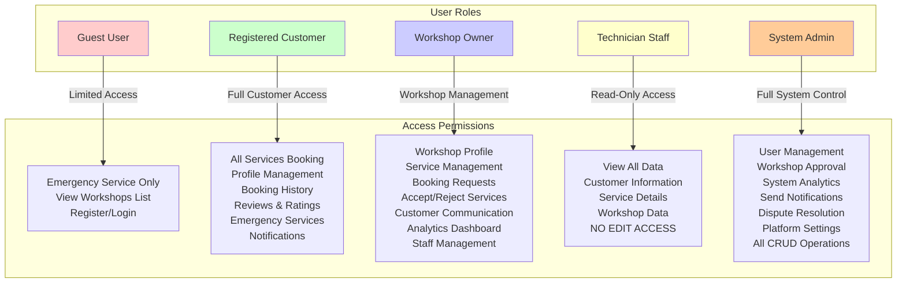
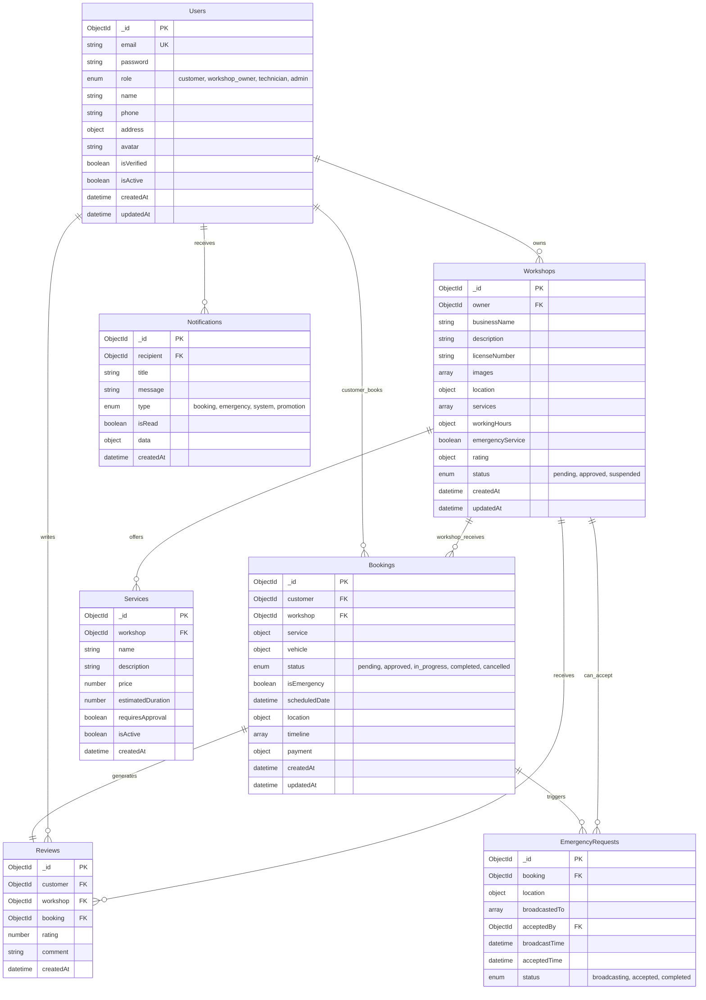
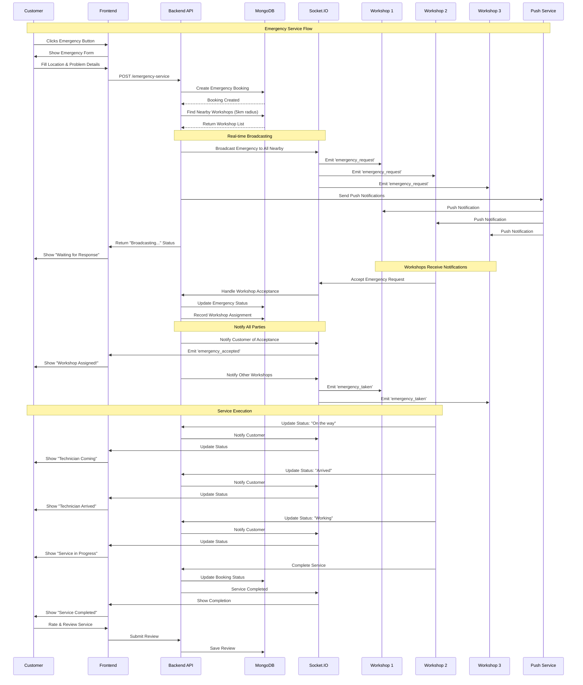
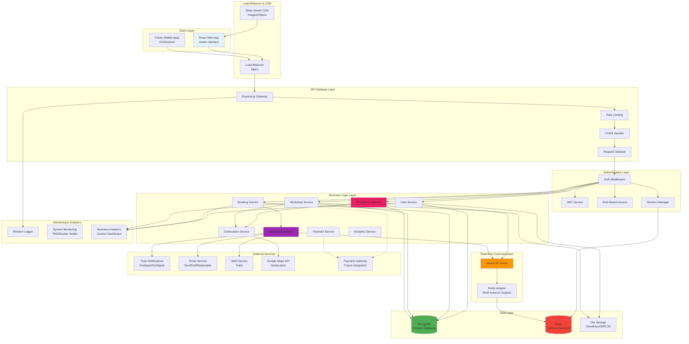

# **Car Service Marketplace - Main Architecture**

## **System Architecture Overview**

### **Backend Architecture (Node.js + TypeScript + MongoDB)**

```
┌─────────────────────────────────────────────────────────────┐
│                     CLIENT LAYER                            │
├─────────────────────────────────────────────────────────────┤
│  React Frontend (Arabic)  │  Future Mobile Apps             │
└─────────────────────────────────────────────────────────────┘
                              │
                              ▼
┌─────────────────────────────────────────────────────────────┐
│                   API GATEWAY LAYER                         │
├─────────────────────────────────────────────────────────────┤
│  • Express.js Router                                        │
│  • Rate Limiting & Throttling                              │
│  • CORS Configuration                                       │
│  • Request Validation                                       │
└─────────────────────────────────────────────────────────────┘
                              │
                              ▼
┌─────────────────────────────────────────────────────────────┐
│                 AUTHENTICATION LAYER                        │
├─────────────────────────────────────────────────────────────┤
│  • JWT Token Management                                     │
│  • Role-based Access Control (RBAC)                        │
│  • Session Management                                       │
│  • OAuth Integration (Future)                              │
└─────────────────────────────────────────────────────────────┘
                              │
                              ▼
┌─────────────────────────────────────────────────────────────┐
│                   BUSINESS LOGIC LAYER                      │
├─────────────────────────────────────────────────────────────┤
│  Service Layer (Modular Architecture)                      │
│  ┌─────────────┬─────────────┬─────────────┬─────────────┐  │
│  │    User     │   Booking   │  Workshop   │   Emergency │  │
│  │  Service    │   Service   │   Service   │   Service   │  │
│  └─────────────┴─────────────┴─────────────┴─────────────┘  │
│  ┌─────────────┬─────────────┬─────────────┬─────────────┐  │
│  │ Notification│   Payment   │  Analytics  │    Admin    │  │
│  │  Service    │   Service   │   Service   │   Service   │  │
│  └─────────────┴─────────────┴─────────────┴─────────────┘  │
└─────────────────────────────────────────────────────────────┘
                              │
                              ▼
┌─────────────────────────────────────────────────────────────┐
│                    DATA ACCESS LAYER                        │
├─────────────────────────────────────────────────────────────┤
│  • MongoDB with Mongoose ODM                               │
│  • Repository Pattern                                       │
│  • Data Validation & Sanitization                          │
│  • Connection Pooling                                       │
└─────────────────────────────────────────────────────────────┘
                              │
                              ▼
┌─────────────────────────────────────────────────────────────┐
│                   EXTERNAL SERVICES                         │
├─────────────────────────────────────────────────────────────┤
│  • Real-time Communication (Socket.IO)                     │
│  • Push Notifications (Firebase/OneSignal)                 │
│  • Email Service (Nodemailer)                              │
│  • SMS Service (Twilio)                                    │
│  • Maps & Geolocation (Google Maps API)                    │
│  • File Storage (Cloudinary/AWS S3)                        │
└─────────────────────────────────────────────────────────────┘
```

## **Technology Stack**

### **Backend Dependencies**

```json
{
  "dependencies": {
    "express": "^4.18.0",
    "typescript": "^5.0.0",
    "mongoose": "^7.0.0",
    "socket.io": "^4.7.0",
    "jsonwebtoken": "^9.0.0",
    "bcryptjs": "^2.4.3",
    "joi": "^17.9.0",
    "nodemailer": "^6.9.0",
    "multer": "^1.4.5",
    "cloudinary": "^1.37.0",
    "express-rate-limit": "^6.7.0",
    "helmet": "^7.0.0",
    "cors": "^2.8.5",
    "dotenv": "^16.0.0",
    "node-cron": "^3.0.0",
    "geolib": "^3.3.4"
  },
  "devDependencies": {
    "@types/node": "^20.0.0",
    "@types/express": "^4.17.0",
    "nodemon": "^2.0.0",
    "ts-node": "^10.9.0"
  }
}
```

### **Folder Structure**

```
backend/
├── src/
│   ├── controllers/
│   │   ├── auth.controller.ts
│   │   ├── booking.controller.ts
│   │   ├── workshop.controller.ts
│   │   ├── user.controller.ts
│   │   └── admin.controller.ts
│   ├── services/
│   │   ├── auth.service.ts
│   │   ├── booking.service.ts
│   │   ├── workshop.service.ts
│   │   ├── notification.service.ts
│   │   ├── emergency.service.ts
│   │   └── geolocation.service.ts
│   ├── models/
│   │   ├── User.model.ts
│   │   ├── Workshop.model.ts
│   │   ├── Booking.model.ts
│   │   └── Notification.model.ts
│   ├── middleware/
│   │   ├── auth.middleware.ts
│   │   ├── validation.middleware.ts
│   │   ├── upload.middleware.ts
│   │   └── rateLimit.middleware.ts
│   ├── routes/
│   │   ├── auth.routes.ts
│   │   ├── booking.routes.ts
│   │   ├── workshop.routes.ts
│   │   └── admin.routes.ts
│   ├── utils/
│   │   ├── database.ts
│   │   ├── socketHandlers.ts
│   │   ├── emailTemplates.ts
│   │   └── helpers.ts
│   ├── config/
│   │   ├── database.config.ts
│   │   ├── jwt.config.ts
│   │   └── app.config.ts
│   └── app.ts
├── package.json
└── tsconfig.json
```

---
## **Role-Based Access Control (RBAC) Details**

### **1. Guest User 👤**

**Limited Emergency Access Only**

- Can view workshops list without details
- Can access emergency service (limited form)
- Must register to book regular services
- No profile or history access

### **2. Registered Customer 👤✅**

**Full Consumer Access**

- Complete service booking system
- Profile and vehicle management
- Booking history and tracking
- Emergency services with full features
- Reviews and ratings system
- Real-time notifications

### **3. Workshop Owner 🏪**

**Business Management Access**

- Workshop profile and service catalog management
- Incoming booking request management
- Staff and technician assignment
- Business analytics and reports
- Customer communication tools
- Service approval/rejection workflow

### **4. Technician Staff 🔧**

**Read-Only System Access**

- View all customer information
- Access booking and service details
- Workshop data visibility
- **NO EDIT PERMISSIONS** (Important Security Feature)
- Reports and analytics viewing only

### **5. System Admin 👑**

**Full Platform Control**

- Complete user management (CRUD)
- Workshop approval workflow
- Platform-wide analytics
- Custom notification broadcasting
- Dispute resolution tools
- System configuration management





---


## **Critical Page Flows**

```mermaid
flowchart TD
    Landing[🏠 Landing Page<br/>عربي] --> |Guest| GuestFlow
    Landing --> |Login| AuthPages
    
    subgraph "Authentication Flow"
        AuthPages[🔐 Auth Pages]
        Login[تسجيل الدخول]
        Register[تسجيل جديد]
        ForgotPass[نسيت كلمة المرور]
        
        AuthPages --> Login
        AuthPages --> Register
        Login --> ForgotPass
    end
    
    subgraph "Guest User Flow"
        GuestFlow[👤 Guest Access]
        GuestEmergency[🚨 Emergency Service]
        GuestWorkshops[🔍 Browse Workshops]
        GuestRegister[📝 Register to Book]
        
        GuestFlow --> GuestEmergency
        GuestFlow --> GuestWorkshops
        GuestWorkshops --> GuestRegister
    end
    
    Login --> RoleRouter{User Role?}
    Register --> RoleRouter
    
    subgraph "Customer Dashboard"
        RoleRouter -->|Customer| CustomerDash[🏠 Customer Dashboard]
        CustomerDash --> CustomerProfile[👤 Profile Management]
        CustomerDash --> BookService[📅 Book Service]
        CustomerDash --> BookingHistory[📋 Booking History]
        CustomerDash --> EmergencyBtn[🚨 Emergency Service]
        CustomerDash --> Notifications[🔔 Notifications]
        CustomerDash --> Reviews[⭐ Reviews & Ratings]
        
        BookService --> SelectWorkshop[🏪 Select Workshop]
        SelectWorkshop --> ServiceDetails[🔧 Service Details]
        ServiceDetails --> BookingConfirm[✅ Confirm Booking]
        BookingConfirm --> TrackingPage[📍 Track Service]
        
        EmergencyBtn --> EmergencyForm[🚨 Emergency Form]
        EmergencyForm --> EmergencyWait[⏳ Waiting Response]
        EmergencyWait --> TrackingPage
        
        BookingHistory --> BookingDetails[📄 Booking Details]
        BookingDetails --> TrackingPage
    end
    
    subgraph "Workshop Owner Dashboard"
        RoleRouter -->|Workshop Owner| WorkshopDash[🏠 Workshop Dashboard]
        WorkshopDash --> WorkshopProfile[🏪 Workshop Profile]
        WorkshopDash --> ServiceManagement[🔧 Services Management]
        WorkshopDash --> BookingRequests[📥 Booking Requests]
        WorkshopDash --> WorkshopAnalytics[📊 Analytics]
        WorkshopDash --> WorkshopNotifications[🔔 Notifications]
        WorkshopDash --> StaffManagement[👥 Staff Management]
        
        WorkshopProfile --> EditWorkshop[✏️ Edit Profile]
        ServiceManagement --> AddService[➕ Add Service]
        ServiceManagement --> EditService[✏️ Edit Service]
        
        BookingRequests --> ReviewBooking[👀 Review Request]
        ReviewBooking --> AcceptBooking[✅ Accept]
        ReviewBooking --> RejectBooking[❌ Reject]
        AcceptBooking --> ServiceProgress[🔄 Update Progress]
        
        WorkshopAnalytics --> RevenueReport[💰 Revenue Reports]
        WorkshopAnalytics --> ServiceStats[📈 Service Statistics]
    end
    
    subgraph "Technician Access"
        RoleRouter -->|Technician| TechDash[🏠 Technician Dashboard]
        TechDash --> ViewCustomers[👥 View Customers]
        TechDash --> ViewBookings[📋 View All Bookings]
        TechDash --> ViewWorkshops[🏪 View Workshops]
        TechDash --> ViewReports[📊 View Reports]
        
        ViewCustomers --> CustomerDetails[👤 Customer Details]
        ViewBookings --> BookingInfo[📄 Booking Information]
        ViewWorkshops --> WorkshopInfo[🏪 Workshop Information]
    end
    
    subgraph "Admin Panel"
        RoleRouter -->|Admin| AdminDash[🏠 Admin Dashboard]
        AdminDash --> UserManagement[👥 User Management]
        AdminDash --> WorkshopApproval[✅ Workshop Approval]
        AdminDash --> SystemAnalytics[📊 System Analytics]
        AdminDash --> SendNotifications[📢 Send Notifications]
        AdminDash --> SystemSettings[⚙️ System Settings]
        AdminDash --> DisputeResolution[⚖️ Dispute Resolution]
        
        UserManagement --> ViewUsers[👀 View All Users]
        UserManagement --> EditUser[✏️ Edit User]
        UserManagement --> BanUser[🚫 Ban/Suspend User]
        
        WorkshopApproval --> PendingWorkshops[⏳ Pending Approvals]
        WorkshopApproval --> ApproveWorkshop[✅ Approve]
        WorkshopApproval --> RejectWorkshop[❌ Reject]
        
        SendNotifications --> CreateNotification[✏️ Create Notification]
        CreateNotification --> SelectTargets[🎯 Select Recipients]
        SelectTargets --> SendBroadcast[📤 Send Broadcast]
        
        SystemAnalytics --> PlatformStats[📈 Platform Statistics]
        SystemAnalytics --> RevenueTracking[💰 Revenue Tracking]
        SystemAnalytics --> UserActivity[👥 User Activity]
    end
    
    subgraph "Shared Pages"
        TrackingPage --> LiveLocation[📍 Live Tracking]
        TrackingPage --> ServiceUpdates[🔄 Status Updates]
        TrackingPage --> ContactTechnician[📞 Contact Support]
        
        Notifications --> NotificationDetails[📄 Notification Details]
        
        Reviews --> WriteReview[✏️ Write Review]
        Reviews --> ViewReviews[👀 View Reviews]
    end
    
    style Landing fill:#e1f5fe
    style CustomerDash fill:#e8f5e8
    style WorkshopDash fill:#e3f2fd
    style TechDash fill:#fff3e0
    style AdminDash fill:#fce4ec 
```



----

## Database Schema & Relationships




---

## Emergency Service Real-time Flow




---

## Detailed System Architecture



---

## API Endpoints Structure

### Authentication Endpoints

```
POST   /api/auth/register
POST   /api/auth/login  
POST   /api/auth/logout
POST   /api/auth/refresh-token
POST   /api/auth/forgot-password
POST   /api/auth/reset-password
GET    /api/auth/verify-email/:token
```

### User Management

```
GET    /api/users/profile
PUT    /api/users/profile
PUT    /api/users/change-password
POST   /api/users/upload-avatar
DELETE /api/users/account
```

### Workshop Management

```
GET    /api/workshops                    # Public: Browse workshops
GET    /api/workshops/:id               # Public: Workshop details
POST   /api/workshops                   # Workshop Owner: Create workshop
PUT    /api/workshops/:id               # Workshop Owner: Update workshop
DELETE /api/workshops/:id              # Workshop Owner: Delete workshop
GET    /api/workshops/nearby            # Public: Find nearby workshops
POST   /api/workshops/:id/services      # Workshop Owner: Add service
PUT    /api/workshops/:id/services/:serviceId  # Workshop Owner: Update service
DELETE /api/workshops/:id/services/:serviceId # Workshop Owner: Delete service
```

### Booking Management

```
GET    /api/bookings                    # Customer: My bookings
POST   /api/bookings                    # Customer: Create booking
GET    /api/bookings/:id               # Customer/Workshop: Booking details
PUT    /api/bookings/:id/status        # Workshop: Update booking status
DELETE /api/bookings/:id              # Customer: Cancel booking
GET    /api/bookings/workshop/:workshopId # Workshop Owner: Workshop bookings
```

### Emergency Service

```
POST   /api/emergency/request          # Customer/Guest: Create emergency request
GET    /api/emergency/nearby-workshops # System: Find emergency providers
POST   /api/emergency/:id/accept       # Workshop: Accept emergency
PUT    /api/emergency/:id/status       # Workshop: Update emergency status
GET    /api/emergency/:id/track        # Customer: Track emergency service
```

### Reviews & Ratings

```
GET    /api/reviews/workshop/:workshopId # Public: Workshop reviews
POST   /api/reviews                    # Customer: Create review
PUT    /api/reviews/:id                # Customer: Update own review
DELETE /api/reviews/:id               # Customer: Delete own review
GET    /api/reviews/customer/:customerId # Customer: My reviews
```

### Notifications

```
GET    /api/notifications              # User: Get notifications
PUT    /api/notifications/:id/read     # User: Mark as read
PUT    /api/notifications/read-all     # User: Mark all as read
DELETE /api/notifications/:id         # User: Delete notification
POST   /api/notifications/broadcast    # Admin: Send broadcast notification
```

### Analytics & Reports

```
GET    /api/analytics/dashboard        # Role-based dashboard data
GET    /api/analytics/bookings         # Booking statistics
GET    /api/analytics/revenue          # Revenue reports (Workshop/Admin)
GET    /api/analytics/users            # User statistics (Admin)
GET    /api/analytics/workshops        # Workshop statistics (Admin)
```

### Admin Management

```
GET    /api/admin/users                # Admin: List all users
PUT    /api/admin/users/:id/status     # Admin: Ban/activate user
GET    /api/admin/workshops/pending    # Admin: Pending workshop approvals
PUT    /api/admin/workshops/:id/approve # Admin: Approve workshop
PUT    /api/admin/workshops/:id/reject  # Admin: Reject workshop
GET    /api/admin/system-stats         # Admin: System statistics
POST   /api/admin/notifications        # Admin: Send system notifications
```

### File Upload

```
POST   /api/upload/image               # Upload single image
POST   /api/upload/images              # Upload multiple images
POST   /api/upload/document            # Upload document
DELETE /api/upload/:fileId             # Delete uploaded file
```

### Geolocation Services

```
GET    /api/geo/nearby-workshops       # Find workshops by location
POST   /api/geo/calculate-distance     # Calculate distance between points
GET    /api/geo/geocode                # Convert address to coordinates
GET    /api/geo/reverse-geocode        # Convert coordinates to address
```

### Real-time Socket Events

```javascript
// Customer Events
socket.emit('join_customer', customerId);
socket.on('booking_status_updated', (data) => {});
socket.on('emergency_accepted', (data) => {});
socket.on('technician_location', (data) => {});
socket.on('new_notification', (data) => {});

// Workshop Events  
socket.emit('join_workshop', workshopId);
socket.on('emergency_request', (data) => {});
socket.on('new_booking', (data) => {});
socket.on('booking_cancelled', (data) => {});
socket.on('emergency_taken', (data) => {});

// Admin Events
socket.emit('join_admin');
socket.on('new_workshop_registration', (data) => {});
socket.on('system_alert', (data) => {});
```

### Middleware Stack

```javascript
// Applied to all routes
app.use(helmet());           // Security headers
app.use(cors());            // CORS handling
app.use(rateLimit());       // Rate limiting
app.use(compression());     // Response compression
app.use(morgan());          // Request logging

// Authentication required
app.use('/api/users', authenticate);
app.use('/api/bookings', authenticate);
app.use('/api/workshops', authenticate); // Except GET requests

// Role-based access
app.use('/api/admin/*', requireRole(['admin']));
app.use('/api/workshops/manage', requireRole(['workshop_owner']));
```

### Response Format Standards

```javascript
// Success Response
{
  "success": true,
  "data": { ... },
  "message": "Operation completed successfully",
  "timestamp": "2025-05-29T10:30:00Z"
}

// Error Response  
{
  "success": false,
  "error": {
    "code": "VALIDATION_ERROR",
    "message": "Invalid input data",
    "details": { ... }
  },
  "timestamp": "2025-05-29T10:30:00Z"
}

// Paginated Response
{
  "success": true,
  "data": [...],
  "pagination": {
    "page": 1,
    "limit": 20,
    "total": 150,
    "totalPages": 8
  }
}
```

## Status Codes Used

- `200` - Success
- `201` - Created
- `400` - Bad Request
- `401` - Unauthorized
- `403` - Forbidden
- `404` - Not Found
- `409` - Conflict
- `422` - Validation Error
- `429` - Rate Limit Exceeded
- `500` - Internal Server Error
---

